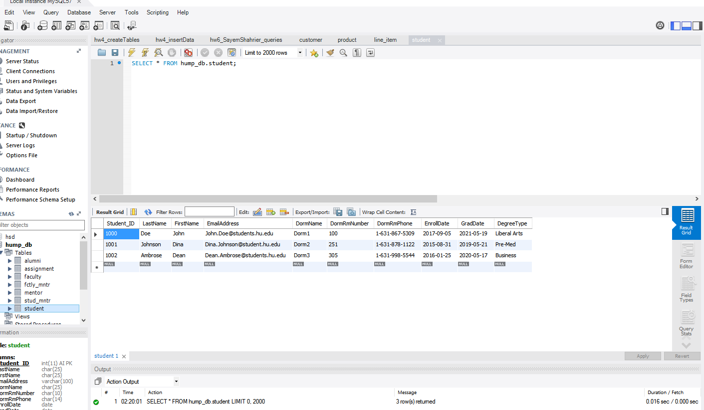

# Highline University’s Mentor Program (HUMP)  Database System

## Project Description

As a database designer I developed a capstone project that encomposses the requirements of our client and produce a database system with a breakdown of tables including faculty, student, alumni, and connecting them all together with their appropriate attributes.

### Getting Started

These instructions will get you a copy of the project up and running on your local machine for development and testing purposes.
- git clone “https://github.com/sshahrier/school-database-system.git”
- Run the `.erd` for diagrams and `.sql` files look into the development of our project. We have also included a Project Report in `.docx` as a technical document for frame of reference.

### Prerequisites

There are no additional installation of packages or libraries required for this project all you require is a MySQL Workbench, ER Assistant Tool, and Microsoft Office Word.

## Contributors
- [Sayem Shahrier](https://github.com/sshahrier)
- [Justin Beach](https://www.linkedin.com/in/justin-beach-99273513a/)

## License & Copyright

Licensed under the [MIT License](LICENSE).
 
Copyright ©️ 2018. Sayem Shahrier.
 
All Rights Reserved.
